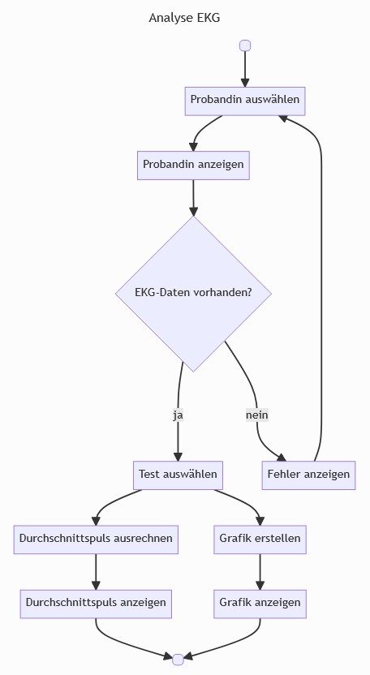

# Programmierübung 2

## Ziel des Projektes
Hier wird eine Leistungskurve aus einer __CSV__ Datei geplotet. 

Hier werden die ersten Schritte beschrieben:

## Umgang mit PDM

- Zum Aufsetzten eines Projektes einmalig `pmd init`
- Zum installieren eines Projektes nach dem clonen `pmd install`
- Zum Hinzufügen eines Paketes `pdm add <packetname>`

- `gitignore` legt fest, was von git ignoriert wird.  Hier muss __immer vor__ dem ersten Comit der Ordner `.venv` drin stehen. 

## Nutzung des Projektes 

Dann nutzt man [`diesen Link`](https://github.com/JonPer00/proueb_2025) um das Repository in Visual Sudio Code zu Klonen. 

Lediglich `pdm install` reicht aus, um alle anderen Datei mitzuinstallieren. 

Um die Kurve aus der __CSV__ Datei zu erzeugen, muss nun unter src die Datei power_curve.py ausgeführt werden. 

Funfact, die Grau markierte Fläche unter der Kurve, stellt die verbrauchte Energie dar. 

Nun kann man das Projekt einwandfrei nutzen. __Viel Spaß!__
:) 

### Die dazugehörig Grafik: 

# EKG Analyze APP

## Funktionsumfang

- Die App ermöglicht die Analyse von EKG Daten.
- Dabei werden folgende USe Case unterstützt:

### Funktionale Anforderungen:

- [ ] Als Nutzer:in möchte ich eine Versuchsperson auswählen und die relevanten Daten angezeigt bekommen
- [ ] Als Nutzer:in möchte ich mir das Bild einer Versuchsperson anzeigen lassen, um mich zu vergewissern, dass ich die richtige Person anzeige (Termin 2)
- [ ] Als Nutzer:in möchte ich die zu einer Versuchsperson gehörenden EKG Datensätze auswählen können (sofern es mehrere gibt)
- [ ] Als Nutzer:in möchte ich die EKG-Daten einer Versuchsperson als Grafik anzeigen lassen (Termin 3)
- [ ] Als Nutzer:in möchte ich mir den Durchschnittspuls einer Versuchsperson als Zahl anzeigen lassen (Termin 4)

## Implementierung (Pflichtenheft - Wie?)

### Ablaufdiagramm 
Die User Journey wir in einem Ablaufdiagramm dargestellt:

## Anwendung der App

1. Sicherstellen, dass virtuelle Umgebung aktiviert ist. `venv/Scripts/activate`
2. Abhängigkeiten instellieren `streamlit run main.py`

